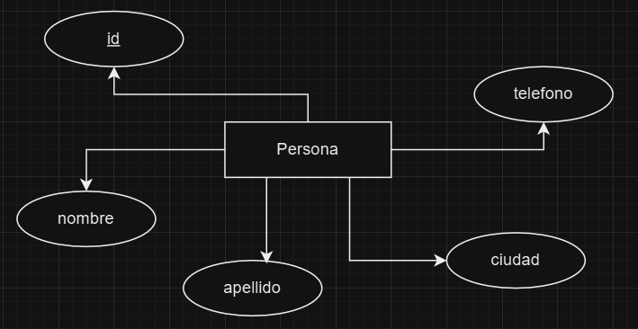

# Introducción a MySQL

*SQL: Structured Query Language
Es el lenguaje que usa las base de datos.*

---
SQL se ha convertido en un estandar de 
facto a nivel internacional para las 
bases de datos.
---

SQL nos permite realizar distintas operaciones.

* Crear (registros, tablas, etc)
* Modificar
* Leer
* Eliminar

Es decir, las operaciones CRUD 
(Create, Read, Update, Delete)

> SQL se subdivide en varios sublenguajes:

1. DDL (Data Definition Language):
Define las entitades modeladas.
2. DML (Data Manipulation Language):
Consular y modificar datos.
3. DQL (Data Query Language):
Por excelencia para consultar datos.
4. DCL (Data Contro Language):
Nos permite administrar permisos y accesos

> DDL: Data Definition Language:
> 
Los comandos básicos son:
* CREATE: permite crear base de datos, 
tablas y vistas.
* ALTER: permite modificar una tabla.
* DROP: permite eliminar bases de datos,
tablas o columnas.

¿Como iniciar el modo texto de MySQL?
```shell
    mysql -u root -p
```

¿Como crear una base de datos?
```roomsql
    CREATE SCHEMA 'nombre_bd';
```

¿Como ver las bases de datos?
````roomsql
    SHOW DATABASES;
````
¿Como usar una base de datos?
```roomsql
    USE 'nombre_bd';
```

Diagrama de una entidad de ejemplo:



¿Como crear una entidad?
```roomsql
    CREATE TABLE persona(
        id INT AUTO_INCREMENT,
        nombre VARCHAR(45),
        apellido VARCHAR(45),
        ciudad VARCHAR(45),
        telefono VARCHAR(45),
        PRIMARY KEY('id')
    );
```

¿Como limpiar la consola de MySQL?
```sql
    \! cls;
```
¿Como cancelar una sentencia?

ctrl + c

¿Como visualizar las tablas de una BD?
```roomsql
    SHOW TABLES;
```

¿Como ver la descripción de una tabla?
```roomsql
    DESC 'nombre_tabla';
```

¿Como agregar una columna en una tabla existente?
```roomsql
    ALTER TABLE persona
    ADD COLUMN fecha_nacimiento
    DATETIME NULL AFTER ciudad;
```

¿Como eliminar una columna en una tabla existente?
```roomsql
    ALTER TABLE persona
    DROP COLUMN fecha_nacimiento;
```

¿Como cambiar el nombre de una columna?
```roomsql
    ALTER TABLE persona
    CHANGE apellido email VARCHAR(90);
```

Vistas: es una consulta personalizada 
que se crea para no tener que escribir 
el query cada vez que se desea ejecutar.

Nota: para poder crear una vista lo ideal
es que tenga algunos registros la tabla a 
consultar.

> DML: Data Manipulation Language

Sus comandos básicos son:

* SELECT: Selecciona los campos a consultar.
* INSERT: Insertar registros en la tabla.
* UPDATE: Modifica algunos valores de algunos campos de la tabla.
* DELETE: Eliminar registro de una de una tabla.

¿Como insertar datos en una tabla?
Generalmente a cada fila de una tabla le 
llamamos registro.

Usamos el comando INSERT:
```roomsql
    INSERT INTO persona(nombre,email,ciudad,telefono) 
    VALUES ('Laura','lau23cdmx@gmail.com','cdmx','5512345678');
```

Nota: el 'id' no es necesario considerarlo
ya que se genera en automatico.

¿Como podemos hacer multiples insersiones en una
tabla?

```roomsql
     INSERT INTO persona (nombre,email,ciudad,telefono)
     VALUES
     ('Raul','rau22lopz@gmail.com','Monterrey','7712341234'),
     ('Marlene','mar20jimz@gmail.com','Queretaro','5522134412'),
     ('Carlos','carlos100zuriaga@gmail.com','Cancún','5500918273');
```

¿Como podemos modificar un valor de una campo 
en un registro? 

Usando el comando UPDATE

```roomsql
    UPDATE persona
    SET ciudad = 'CDMX'
    WHERE id=1;
```

¿Como podemos eliminar un registro de una
tabla?

**NOTA**: tener cuidado al eliminar un registro
ya que si no lo hacemos con detalle podriamos eliminar
todos los registros.

```roomsql
    DELETE FROM persona
    WHERE id=2;
```

> DQL: Data Query Language:

Se usa para realizar consultas y recuperar
datos de la base de datos (registros).

¿Como podemos consultar todos los registros
de una tabla?

Usando el comando SELECT
```roomsql
    SELECT *
    FROM persona;
```

¿Como consultar solamente algunos campos de una tabla?

```roomsql
    SELECT nombre,ciudad
    FROM persona;
```

¿Como podemos consultar solamente algunos
registros?

```roomsql
    SELECT *
    FROM persona
    WHERE id >= 2;
```

**Nota final:** 
1. SELECT delimina las
columnas
2. FROM seleccion la tabla o vista
3. WHERE delimina los registros bajo una condición

*Extra:  MySQL nos permite usar un conjunto de 
funciones ya incluidas para obtener datos sobre 
los datos.*

Ejemplo:

¿Como podemos contar todos los registros de una 
tabla?

```roomsql
    SELECT COUNT(*)
    AS total_personas
    FROM persona;
```

Existen otras funciones como:
SUM, AVG, etc...

> DCL: Data Control Language:

Se usa para gestionar permisos y privilegios
en una base de datos.

Sus comandos principales son:

* GRANT: conceder permisos a usuarios o roles 
* REVOKE: quita los permisos previamente concedidos.

---

## ¿Cómo cambiarle el nombre a una base de datos?

*No hay un comando directo para cambiar el nombre
de una base de datos, pero, podemos generar una copia
de una base de datos con el nombre que queremos y 
luego eliminar la base de datos anterior.*

### Pasos a seguir: 

1. Crear una nueva base de datos.
```roomsql
    CREATE DATABASE nuevo_nombre;
```

2. Copiar las tablas de la bd antigua en la nueva.

**Nota: debemos ejecutar desde la línea de comandos
de windows y no de mysql.**
```shell
    mysqldump -u root -p bd_original | mysql -u root -p bd_nueva
```

3. Verificar la nueva base de datos

*Revisar que la nueva base de datos tenga las 
mismas tablas y los mismos registros.*

````roomsql
    SHOW TABLES;
    SELECT *
    FROM tabla_a_checar;
````

4. Eliminar la base de datos original.

```roomsql
    DROP DATABASE bd_original;
```

## ¿Como crear un respaldo de una BD?

```roomsql
mysqldump -u root -p biblioteca > biblioteca_respaldo.sql
```


